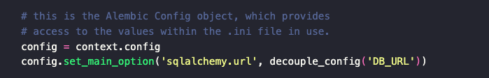
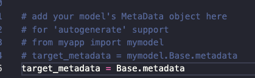

Para gerar migrations estamos usando a lib alembic.
comando para gerar, no terminal: alembic init migrations

Por questões de lembrar as configs, é necessário alterar o arquivo env.py dentro da pasta
migrations:

 
E adicionar o Base com os metadatas de suas models: 

 
Para gerar as migrations, basta executar no terminal o comando: 
alembic revision --autogenerate -m "add users table"  

O comando acima gera o script da migration, com o passo a passo para as models serem criadas no BD. 
Agora iremos executar o comando para realmente criar a tabela:
comando: alembic upgrade head
